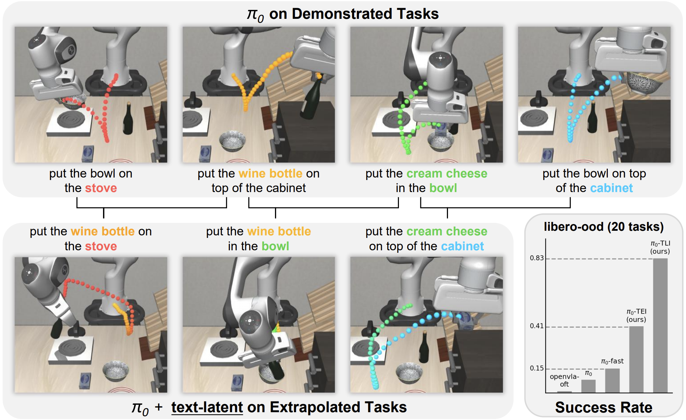

This is the official implementation of the paper: **Task Reconstruction and Extrapolation for $\pi_0$ using Text Latent
**

[[Arxiv](https://arxiv.org/pdf/2505.03500)]



## Installation

The whole repo is built upon the [openpi](https://github.com/Physical-Intelligence/openpi). Thus, the
installation is the same as the openpi project.
Here, we give a brief guide to install the openpi project.
If your encounter any problem, please refer to the openpi project or file an issue for us.

Please clone this project first by

```bash
git clone git@github.com:QuanyiLi/pi0-text-latent.git
````

**Note:** I include the LIBERO to the git history instead of using git-submodule,
so the repo size is a bit large (~200M).

Then, create a conda environment with python 3.10 and install the dependencies:

```bash
conda create -n text-latent python=3.11 -y
conda activate text-latent
pip install uv
cd pi0-text-latent/
GIT_LFS_SKIP_SMUDGE=1 uv sync
GIT_LFS_SKIP_SMUDGE=1 uv pip install -e .
```

This is the first venv we will use to launch the policy model.
After this, we need to build another environment for the LIBERO benchmark. Please open another terminal and run:

```bash
cd pi0-text-latent/ # at the root path
uv venv --python 3.8 examples/libero/.venv
source examples/libero/.venv/bin/activate
uv pip sync examples/libero/requirements.txt third_party/modified_libero/requirements.txt --extra-index-url https://download.pytorch.org/whl/cu113 --index-strategy=unsafe-best-match
uv pip install -e packages/openpi-client
uv pip install -e third_party/modified_libero
export PYTHONPATH=$PYTHONPATH:$PWD/third_party/modified_libero
```

If you wanna skip the step for text latent identification, you can pull
ready-to-use text-latent from [hugging-face](https://huggingface.co/datasets/Shady0057/pi0-text-latent).
It is recommended to follow these steps:

```bash
cd pi0-text-latent/ # at the root path
GIT_LFS_SKIP_SMUDGE=1 git clone https://huggingface.co/datasets/Shady0057/pi0-text-latent
mv pi0-text-latent exp_data
cd exp_data
git lfs pull
```

All files should be organized as `openpi/exp_data/pi0/*.pkl`.

## Running Experiments

Open two terminals, in the first one, activate the first venv run:

```bash
python scripts/serve_policy.py
```

Then in the second terminal, activate the second venv and run:

```bash
python examples/libero/main.py
```

This will by default run the extrapolation experiments, while this script actually prepared all experiments in the
paper. The videos will be saved to ```pi0-text-latent/data/libero/```
You can go to this script and config what experiments you would like to run.
**Note:** if you have another libero env installed, you need to edit the ```~/.libero/config.yaml``` file to point to
the correct path of the `libero` package and assets.

## Text Latent Identification

For the text latent identification, we provide a script to run it at `scripts/text_latent.py`.
It will launch the model and run it on the libero-dataset to record the model's hidden states.
You don't need to setup the dataset explicitly, as the script will download the dataset automatically.

## Changes to LIBERO benchmark

The openpi project includes the LIBERO as a part of the repo. Thus we build new task suites by adding bddl files to it
and register them. The bddl files are located in the `thrid_party/libero/libero/libero/bddl_files` folder.

In addition, we slightly slack the contact threshold from 0.03 to 0.1 in `libero/envs/object_state`, as we find
sometimes
when the object is indeed on the plate but the contact is not detected, which leads to the failure of the task.
Also, for putting objects on the stove tasks, we do not strictly ask the model to put it at the cooking region,
but putting on top of the stove is counted as success.
If you are using a standard LIBERO benchmark without these two changes, the performance will drop a bit (around 5%),
while you may find some episodes are indeed successful.

## Citation

If you find this work useful, please cite our paper:

```bibtex
@misc{li2025taskreconstructionextrapolationpi0,
      title={Task Reconstruction and Extrapolation for $\pi_0$ using Text Latent}, 
      author={Quanyi Li},
      year={2025},
      eprint={2505.03500},
      archivePrefix={arXiv},
      primaryClass={cs.RO},
      url={https://arxiv.org/abs/2505.03500}, 
}
```